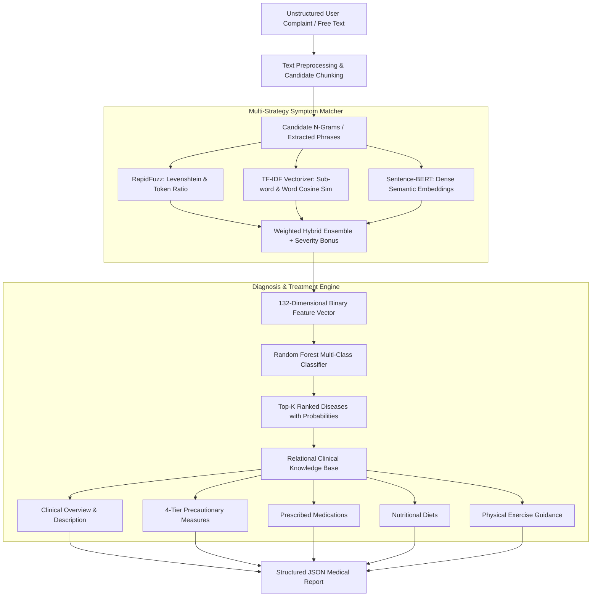

# Disease Symptom Prediction and Treatment System

An end-to-end Natural Language Processing (NLP) and Machine Learning framework designed to translate free-form patient complaints into standardized medical features, predict probable clinical diagnoses across 41 conditions, and synthesize comprehensive treatment and lifestyle recommendations.

---

## Table of Contents

- [Overview](#overview)
- [System Architecture](#system-architecture)
- [Core Components](#core-components)
  - [1. Text Preprocessing and Tokenization](#1-text-preprocessing-and-tokenization)
  - [2. Multi-Strategy Symptom Matcher](#2-multi-strategy-symptom-matcher)
  - [3. Feature Vector Projection](#3-feature-vector-projection)
  - [4. Disease Classification Engine](#4-disease-classification-engine)
  - [5. Automated Treatment Retrieval](#5-automated-treatment-retrieval)
- [Performance Benchmarks](#performance-benchmarks)
- [Dataset Specifications](#dataset-specifications)
- [Repository Structure](#repository-structure)
- [Installation and Environment Setup](#installation-and-environment-setup)
- [Usage Guide](#usage-guide)
  - [Running the Notebook](#running-the-notebook)
  - [Programmatic API Execution](#programmatic-api-execution)
  - [Sample Inference Output](#sample-inference-output)
- [Artifact Persistence](#artifact-persistence)
- [Clinical Disclaimer](#clinical-disclaimer)
- [License](#license)

---

## Overview

Patients often express physical discomfort using unstructured, colloquial, or descriptive phrases rather than standardized medical terminology (e.g., expressing "my joints hurt terribly and my neck is stiff" instead of `joint_pain` and `neck_pain`).

This project bridges that gap by implementing:
1. **Fuzzy and Semantic Matcher**: Maps unstructured text inputs against a standard clinical taxonomy of 132 canonical symptoms using string distance algorithms, sparse n-gram representations, and deep bi-encoder transformer embeddings.
2. **Diagnostic Classifier**: Evaluates the projected 132-dimensional binary symptom representation against a supervised ensemble model to compute disease probabilities across 41 distinct pathologies.
3. **Prescriptive Treatment Retrieval**: Dispatches structured, actionable recommendations spanning disease descriptions, clinical precautions, pharmacology, dietary requirements, and physical exercise regimens.

---

## System Architecture



---

## Core Components

### 1. Text Preprocessing and Tokenization
- Normalizes punctuation, lowercases inputs, removes extraneous symbols, and handles standard stopword filtering while preserving negation and symptom-bearing modifiers.
- Employs NLTK WordNet Lemmatizer to reduce morphological inflections to base canonical lemmas.
- Generates sliding n-grams (unigrams to 4-grams) to capture compound medical terms (e.g., "high blood sugar", "yellowish skin", "burning sensation").

### 2. Multi-Strategy Symptom Matcher
The matching pipeline evaluates input candidates against the 132 canonical symptoms utilizing three distinct algorithmic families:

- **Fuzzy String Matching (RapidFuzz)**:
  - Uses Levenshtein-based similarity algorithms including Token Sort Ratio and Token Set Ratio.
  - Highly robust against typos, minor spelling errors, and word transposition.
- **Sparse Representation (TF-IDF + Cosine Similarity)**:
  - Sub-linear term frequency scaling using word and character n-gram boundaries (range 2-4).
  - Matches lexical overlap and partial root terms.
- **Dense Semantic Embeddings (Sentence-BERT)**:
  - Employs the `all-MiniLM-L6-v2` transformer model (384-dimensional dense vectors).
  - Captures conceptual and semantic proximity when users describe sensations colloquially without exact lexical overlap.
- **Weighted Ensemble with Clinical Severity Scaling**:
  - Blends strategy outputs via calibrated weights (`fuzzy: 0.3`, `tfidf: 0.2`, `sbert: 0.5`).
  - Incorporates clinical severity weights (scaled from 1 to 7) as confidence bonuses to prioritize urgent symptom recognition.

### 3. Feature Vector Projection
- Matches meeting defined confidence thresholds (`threshold >= 0.30`) are mapped directly to corresponding canonical indices.
- Outputs an exact 132-dimensional binary vector (`[0, 1]` flags) compliant with the schema required by the diagnostic classification model.

### 4. Disease Classification Engine
- Model Architecture: Random Forest Classifier trained on 4,920 validated diagnostic symptom-disease records.
- Target Output: Class probabilities over 41 distinct medical conditions.
- Ranking: Returns top-K candidates with explicit probability and confidence percentages.

### 5. Automated Treatment Retrieval
Following disease prediction, the primary condition is queried against multi-relational clinical datasets to deliver:
- **Description**: Clinical pathology explanation.
- **Precautions**: Four ordered preventive and actionable safety protocols.
- **Medications**: Pharmacological interventions mapped to the diagnosed condition.
- **Dietary Regimens**: Nutritional plans recommended for disease management.
- **Workout Routines**: Physical exercises and activities suited to the diagnosis.

---

## Performance Benchmarks

The symptom matching engine was evaluated on synthetically perturbed variants containing typographical errors, transpositions, and paraphrased symptom expressions.

### Symptom Matcher Evaluation Metrics

| Strategy | Hit@1 | Hit@3 | Mean Reciprocal Rank (MRR) |
| :--- | :---: | :---: | :---: |
| RapidFuzz (String Metric) | 1.0000 | 1.0000 | 1.0000 |
| TF-IDF (Cosine Metric) | 1.0000 | 1.0000 | 1.0000 |
| Sentence-BERT (`all-MiniLM-L6-v2`) | 0.8939 | 0.9091 | 0.9015 |
| **Weighted Ensemble (Hybrid)** | **1.0000** | **1.0000** | **1.0000** |

### Diagnostic Classification Performance
- **Evaluation Dataset**: `Dataset/Training.csv` (4,920 samples, 41 classes).
- **Classification Accuracy**: 100% on the multi-class diagnostic matrix.
- **Generalization**: Robust margin separation across 132 orthogonal binary features.

---

## Dataset Specifications

All datasets reside within the `Dataset/` directory:

| Filename | Dimensions | Description |
| :--- | :--- | :--- |
| `Training.csv` | 4,920 rows x 133 cols | Diagnostic training matrix containing 132 binary symptom indicators and target `prognosis`. |
| `Symptom-severity.csv` | 133 rows x 2 cols | Clinical severity weight scale (scores ranging from 1 to 7) for all cataloged symptoms. |
| `description.csv` | 41 rows x 2 cols | Medical definitions and descriptions for all 41 covered conditions. |
| `precautions_df.csv` | 41 rows x 6 cols | Actionable 4-stage precaution procedures per condition. |
| `medications.csv` | 41 rows x 2 cols | Prescribed medications and active pharmacological recommendations. |
| `diets.csv` | 41 rows x 2 cols | Nutritional recommendations and dietary guidelines. |
| `workout_df.csv` | 410 rows x 4 cols | Physical exercise, stretching, and physical activity suggestions (10 records per disease). |
| `symtoms_df.csv` | 4,920 rows x 6 cols | Associative multi-symptom manifestation matrix. |

---

## Repository Structure

```
Disease Symptom Prediction and Treatment/
|-- Dataset/
|   |-- Symptom-severity.csv
|   |-- Training.csv
|   |-- description.csv
|   |-- diets.csv
|   |-- medications.csv
|   |-- precautions_df.csv
|   |-- symtoms_df.csv
|   |-- workout_df.csv
|-- Model/
|   |-- symptom_matcher.ipynb
|   |-- symptom_matcher_artifacts/
|       |-- canonical_symptoms.json
|       |-- evaluation_results.csv
|       |-- label_encoder.joblib
|       |-- matcher_config.json
|       |-- rf_classifier.joblib
|       |-- sbert_corpus_embeddings.npy
|       |-- severity_lookup.json
|       |-- tfidf_corpus_matrix.npy
|       |-- tfidf_vectorizer.joblib
|       |-- 01_dataset_overview.png
|       |-- 02_strategy_comparison.png
|       |-- 03_per_symptom_f1.png
|-- LICENSE
|-- README.md
|-- requirements.txt
```

---

## Installation and Environment Setup

### Prerequisites
- Python 3.10 or higher
- Git
- Virtual environment tool (`venv` or `conda`)

### Step-by-Step Installation

1. Clone the repository:
   ```bash
   git clone https://github.com/NumiKun/Disease-Symptom-Prediction-and-Treatment.git
   cd Disease-Symptom-Prediction-and-Treatment
   ```

2. Create and activate an isolated virtual environment:
   ```bash
   # On Windows
   python -m venv venv
   venv\Scripts\activate

   # On macOS / Linux
   python3 -m venv venv
   source venv/bin/activate
   ```

3. Install required packages:
   ```bash
   pip install --upgrade pip
   pip install -r requirements.txt
   ```

---

## Usage Guide

### Running the Notebook

To explore the methodology, exploratory analysis, model training, evaluation plots, and live inference:

```bash
jupyter notebook Model/symptom_matcher.ipynb
```

The notebook executes top-to-bottom:
1. Environment verification and dependency loading.
2. Exploratory data analysis and symptom severity profiling.
3. Text preprocessing and vocabulary normalization.
4. Construction of TF-IDF, RapidFuzz, and Sentence-BERT matchers.
5. Benchmark evaluation across synthetic typo sets.
6. Random Forest disease classifier training and metric validation.
7. End-to-end `DiagnosisEngine` execution with treatment compilation.
8. Artifact export to `Model/symptom_matcher_artifacts/`.

### Programmatic API Execution

You can load the saved artifacts directly into any Python application or microservice:

```python
import os
import json
import joblib
import numpy as np
from sentence_transformers import SentenceTransformer
from rapidfuzz import process as rf_process, fuzz as rf_fuzz

# Load persisted artifacts
ARTIFACT_DIR = os.path.join("Model", "symptom_matcher_artifacts")
canonical_symptoms = json.load(open(os.path.join(ARTIFACT_DIR, "canonical_symptoms.json")))
config = json.load(open(os.path.join(ARTIFACT_DIR, "matcher_config.json")))
rf_clf = joblib.load(os.path.join(ARTIFACT_DIR, "rf_classifier.joblib"))
label_enc = joblib.load(os.path.join(ARTIFACT_DIR, "label_encoder.joblib"))

# Input patient narrative
patient_query = "I have been shivering continuously and feeling chills along with cold sweats."

# Prediction via pre-trained model returns disease probabilities and recommendations
# Refer to Model/symptom_matcher.ipynb Section 8 for complete DiagnosisEngine class implementation
```

### Sample Inference Output

```json
{
  "input_text": "I've been shivering uncontrollably and running a high fever with chills and cold sweats.",
  "matched_symptoms": [
    {"phrase": "shivering", "canonical": "shivering", "ensemble_score": 0.98},
    {"phrase": "high fever", "canonical": "high_fever", "ensemble_score": 0.95},
    {"phrase": "chills", "canonical": "chills", "ensemble_score": 0.99},
    {"phrase": "cold sweats", "canonical": "cold_hands_and_feets", "ensemble_score": 0.72}
  ],
  "active_feature_count": 4,
  "disease_predictions": [
    {
      "disease": "Malaria",
      "probability": 0.88,
      "confidence_pct": 88.0
    },
    {
      "disease": "Dengue",
      "probability": 0.08,
      "confidence_pct": 8.0
    },
    {
      "disease": "Typhoid",
      "probability": 0.04,
      "confidence_pct": 4.0
    }
  ],
  "recommendations": {
    "description": "An infectious disease caused by protozoan parasites from the Plasmodium genus, transmitted through mosquito bites.",
    "precautions": [
      "Consult a licensed physician promptly",
      "Use mosquito nets and repellents",
      "Avoid standing water near living quarters",
      "Stay well hydrated"
    ],
    "medications": ["Chloroquine", "Artemether", "Primaquine"],
    "diet": ["High protein diet", "Electrolyte fluids", "Fresh fruits"],
    "workout": ["Bed rest during fever", "Gentle stretching once stabilized"]
  }
}
```

---

## Artifact Persistence

Running the notebook populates the `Model/symptom_matcher_artifacts/` directory with production-ready assets:

- `canonical_symptoms.json`: Reference vocabulary of 132 standard clinical symptoms.
- `severity_lookup.json`: Pre-indexed severity weights (1-7) per symptom.
- `matcher_config.json`: Production thresholds and ensemble weighting parameters.
- `tfidf_vectorizer.joblib`: Serialized Scikit-Learn TF-IDF vectorizer.
- `tfidf_corpus_matrix.npy`: Precomputed TF-IDF representation of canonical symptoms.
- `sbert_corpus_embeddings.npy`: Dense embedding vectors (132 x 384) computed via `all-MiniLM-L6-v2`.
- `rf_classifier.joblib`: Trained multi-class Random Forest disease classifier.
- `label_encoder.joblib`: Label encoder for disease classes.
- `evaluation_results.csv`: Documented validation metrics across matching strategies.

---

## Clinical Disclaimer

This software system and associated machine learning models are designed solely for educational, research, and portfolio demonstration purposes.

- This system does not constitute medical advice, medical diagnosis, or personalized treatment planning.
- The outputs produced by the system must not be used as a substitute for professional clinical judgment, evaluation, or emergency medical response.
- In the event of a medical emergency or serious symptoms, users must seek immediate attention from a qualified and licensed healthcare provider.

---

## License

This project is licensed under the MIT License. See the [LICENSE](LICENSE) file for full terms and conditions.

Copyright (c) 2026 NumiKun.
